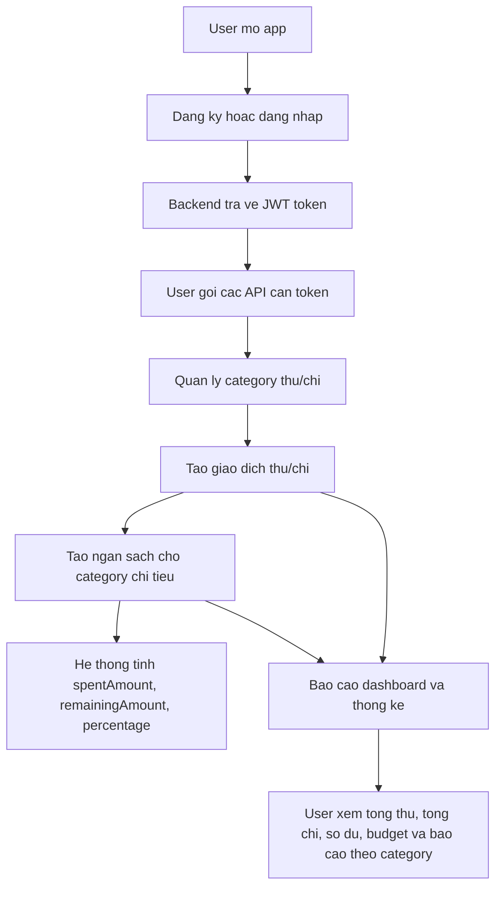

# EZ Finance API Documentation And Demo Guide

## 1. Tong Quan Du An

EZ Finance la ung dung quan ly tai chinh ca nhan. He thong ho tro nguoi dung dang ky, dang nhap, quan ly danh muc thu/chi, ghi nhan giao dich, lap ngan sach theo thang va xem bao cao tong hop.

Backend duoc xay bang Node.js, TypeScript, Express, TypeORM va MySQL. Mobile app duoc xay bang React Native.

## 2. Duong Dan Chay API

Base API URL:

```text
http://localhost:5000/api
```

Swagger UI:

```text
http://localhost:5000/api-docs
```

OpenAPI JSON:

```text
http://localhost:5000/api-docs.json
```

Neu thay doi `PORT` trong file `.env`, thay `5000` bang port tuong ung.

## 3. Xac Thuc

Phan lon API yeu cau JWT Bearer Token. Sau khi goi API dang nhap, copy gia tri `token`, sau do gui kem header:

```http
Authorization: Bearer <token>
```

Trong Swagger UI, bam nut `Authorize` va nhap:

```text
Bearer <token>
```

API khong can token:

- `GET /api/health`
- `POST /api/auth/register`
- `POST /api/auth/login`

API can token:

- Tat ca API con lai.

## 4. Dinh Dang Response Chung

Response thanh cong:

```json
{
  "success": true,
  "message": "Operation completed successfully",
  "data": {}
}
```

Response danh sach co phan trang:

```json
{
  "success": true,
  "message": "Data retrieved successfully",
  "data": [],
  "pagination": {
    "page": 1,
    "limit": 10,
    "totalItems": 25,
    "totalPages": 3
  }
}
```

Response loi:

```json
{
  "success": false,
  "message": "Error message",
  "errors": []
}
```

## 5. Danh Sach API Va Vai Tro

### 5.1 Health API

| Method | Endpoint | Token | Vai tro |
| --- | --- | --- | --- |
| GET | `/api/health` | Khong | Kiem tra server API dang chay hay khong. Dung de demo backend da khoi dong thanh cong. |

### 5.2 Authentication API

| Method | Endpoint | Token | Vai tro |
| --- | --- | --- | --- |
| POST | `/api/auth/register` | Khong | Dang ky tai khoan moi. Khi dang ky thanh cong, he thong tu tao cac danh muc thu/chi mac dinh cho nguoi dung. |
| POST | `/api/auth/login` | Khong | Dang nhap bang email va password. Neu hop le, API tra ve thong tin user va JWT token. |
| GET | `/api/auth/me` | Co | Lay thong tin nguoi dung hien tai tu token. Dung de kiem tra token hop le va user dang dang nhap. |

Body dang ky:

```json
{
  "fullName": "Nguyen Van An",
  "email": "an@example.com",
  "password": "123456"
}
```

Body dang nhap:

```json
{
  "email": "demo@ezfinance.com",
  "password": "123456"
}
```

### 5.3 User Profile API

| Method | Endpoint | Token | Vai tro |
| --- | --- | --- | --- |
| GET | `/api/users/profile` | Co | Lay thong tin ho so ca nhan cua nguoi dung dang dang nhap. |
| PUT | `/api/users/profile` | Co | Cap nhat ho ten hoac email cua nguoi dung. |
| PUT | `/api/users/change-password` | Co | Doi mat khau. API kiem tra mat khau hien tai va yeu cau mat khau moi khac mat khau cu. |

Body cap nhat profile:

```json
{
  "fullName": "Nguyen Van An Updated",
  "email": "newemail@example.com"
}
```

Body doi mat khau:

```json
{
  "currentPassword": "123456",
  "newPassword": "newpassword123"
}
```

### 5.4 Category API

Category la danh muc thu/chi, vi du: Salary, Food, Transport, Shopping. Moi user chi xem va quan ly category cua chinh minh.

| Method | Endpoint | Token | Vai tro |
| --- | --- | --- | --- |
| GET | `/api/categories` | Co | Lay danh sach danh muc cua user. Co the loc theo loai thu/chi hoac tu khoa. |
| GET | `/api/categories/:id` | Co | Lay chi tiet mot danh muc theo ID. |
| POST | `/api/categories` | Co | Tao danh muc moi cho user. |
| PUT | `/api/categories/:id` | Co | Cap nhat ten, loai, icon hoac mau cua danh muc. |
| DELETE | `/api/categories/:id` | Co | Xoa danh muc neu danh muc chua duoc dung trong giao dich hoac ngan sach. |

Query ho tro:

```text
GET /api/categories?type=INCOME
GET /api/categories?type=EXPENSE
GET /api/categories?keyword=food
```

Body tao category:

```json
{
  "name": "Food",
  "type": "EXPENSE",
  "icon": "restaurant",
  "color": "#FF9800"
}
```

Vai tro nghiep vu:

- Category giup phan loai giao dich thanh thu nhap va chi tieu.
- Category la du lieu dau vao bat buoc khi tao transaction.
- Category loai `EXPENSE` duoc dung de tao budget.
- Ten category khong duoc trung trong cung mot user va cung mot loai.

### 5.5 Transaction API

Transaction la giao dich thu/chi cua user. Day la nghiep vu trung tam cua he thong.

| Method | Endpoint | Token | Vai tro |
| --- | --- | --- | --- |
| GET | `/api/transactions` | Co | Lay danh sach giao dich, co phan trang, loc va sap xep. |
| GET | `/api/transactions/:id` | Co | Lay chi tiet mot giao dich. |
| POST | `/api/transactions` | Co | Tao giao dich thu hoac chi. |
| PUT | `/api/transactions/:id` | Co | Cap nhat giao dich. |
| DELETE | `/api/transactions/:id` | Co | Xoa giao dich. |

Query ho tro:

```text
GET /api/transactions?page=1&limit=10
GET /api/transactions?type=EXPENSE
GET /api/transactions?categoryId=1
GET /api/transactions?month=8&year=2026
GET /api/transactions?startDate=2026-08-01&endDate=2026-08-31
GET /api/transactions?keyword=lunch
GET /api/transactions?sortBy=transactionDate&sortOrder=DESC
```

Body tao transaction:

```json
{
  "title": "Lunch",
  "amount": 50000,
  "type": "EXPENSE",
  "categoryId": 1,
  "transactionDate": "2026-08-05",
  "note": "Lunch with classmates"
}
```

Vai tro nghiep vu:

- Ghi lai tien vao va tien ra cua user.
- La nguon du lieu de tinh dashboard, bao cao theo thang, bao cao theo danh muc va tien da chi trong budget.
- Giao dich phai dung category cua user hien tai.
- Loai giao dich phai khop voi loai category, vi du transaction `EXPENSE` phai dung category `EXPENSE`.
- So tien phai lon hon 0.

### 5.6 Budget API

Budget la ngan sach chi tieu theo category, thang va nam. He thong tinh tien da chi dua tren cac transaction loai `EXPENSE`.

| Method | Endpoint | Token | Vai tro |
| --- | --- | --- | --- |
| GET | `/api/budgets` | Co | Lay danh sach ngan sach cua user theo thang/nam, co phan trang. |
| GET | `/api/budgets/:id` | Co | Lay chi tiet ngan sach, kem cac giao dich chi tieu lien quan. |
| POST | `/api/budgets` | Co | Tao ngan sach cho mot category chi tieu trong mot thang/nam. |
| PUT | `/api/budgets/:id` | Co | Cap nhat category, han muc, thang hoac nam cua ngan sach. |
| DELETE | `/api/budgets/:id` | Co | Xoa ngan sach. |

Query ho tro:

```text
GET /api/budgets?month=8&year=2026
GET /api/budgets?categoryId=1&page=1&limit=10
```

Body tao budget:

```json
{
  "categoryId": 1,
  "limitAmount": 3000000,
  "month": 8,
  "year": 2026
}
```

Vai tro nghiep vu:

- Dat han muc chi tieu cho tung category theo thang.
- Cho biet da chi bao nhieu, con lai bao nhieu va da vuot ngan sach hay chua.
- Chi category loai `EXPENSE` moi duoc tao budget.
- Mot user khong duoc tao trung budget cho cung category, thang va nam.

### 5.7 Report API

Report API tong hop du lieu tu transaction, category va budget de phuc vu man hinh dashboard va bieu do.

| Method | Endpoint | Token | Vai tro |
| --- | --- | --- | --- |
| GET | `/api/reports/dashboard` | Co | Lay tong quan trong thang: tong thu, tong chi, so du, so du tat ca thoi gian, so giao dich gan day va tinh hinh budget. |
| GET | `/api/reports/monthly` | Co | Lay bao cao 12 thang trong mot nam, gom tong thu, tong chi va so du tung thang. |
| GET | `/api/reports/expenses-by-category` | Co | Thong ke chi tieu theo category trong thang. Phu hop de ve bieu do tron/cot. |
| GET | `/api/reports/income-by-category` | Co | Thong ke thu nhap theo category trong thang. |

Query ho tro:

```text
GET /api/reports/dashboard?month=8&year=2026
GET /api/reports/monthly?year=2026
GET /api/reports/expenses-by-category?month=8&year=2026
GET /api/reports/income-by-category?month=8&year=2026
```

Vai tro nghiep vu:

- Giup user nhin nhanh tinh hinh tai chinh.
- Cho biet thang nay thu bao nhieu, chi bao nhieu, con du hay am.
- Cho biet category nao dang chi nhieu nhat.
- Cho biet budget nao sap vuot hoac da vuot.

## 6. Luong Hoat Dong Cua Du An



Giai thich flow:

1. User dang ky tai khoan hoac dang nhap tai khoan co san.
2. Backend xac thuc va tra ve JWT token.
3. Mobile app hoac Swagger gui token trong header khi goi API bao ve.
4. User quan ly danh muc thu/chi.
5. User tao giao dich thu nhap hoac chi tieu.
6. User tao ngan sach cho cac category chi tieu theo thang.
7. He thong tu tinh tong thu, tong chi, so du, tien da chi trong budget va bao cao theo category.

## 7. Kich Ban Demo De Trinh Bay Cho Thay

### 7.1 Chuan Bi Truoc Khi Demo

1. Dam bao MySQL dang chay.
2. Tao database `ez_finance` neu chua co.
3. Chay migration:

```bash
npm run migration:run
```

4. Seed data mau:

```bash
npm run seed
```

Tai khoan demo:

```text
Email: demo@ezfinance.com
Password: 123456
```

5. Chay backend:

```bash
npm run dev
```

6. Mo Swagger:

```text
http://localhost:5000/api-docs
```

### 7.2 Thu Tu Demo Khuyen Nghi

#### Buoc 1: Gioi thieu muc tieu app

Noi ngan gon:

```text
EZ Finance la ung dung quan ly tai chinh ca nhan, giup nguoi dung theo doi thu nhap, chi tieu, ngan sach hang thang va bao cao tai chinh.
```

#### Buoc 2: Kiem tra backend

Goi:

```text
GET /api/health
```

Can cho thay:

- Server dang chay.
- Response tra ve `success: true`.

#### Buoc 3: Dang nhap va lay token

Goi:

```text
POST /api/auth/login
```

Body:

```json
{
  "email": "demo@ezfinance.com",
  "password": "123456"
}
```

Can cho thay:

- He thong xac thuc user.
- API tra ve JWT token.
- Copy token va bam `Authorize` trong Swagger.

#### Buoc 4: Kiem tra user hien tai

Goi:

```text
GET /api/auth/me
```

Can cho thay:

- Token dung se lay duoc thong tin user.
- Neu khong co token thi API se bao loi unauthorized.

#### Buoc 5: Demo category

Goi:

```text
GET /api/categories
```

Can cho thay:

- User co danh muc thu/chi rieng.
- Khi seed hoac dang ky, he thong co cac category mac dinh.

Sau do tao category moi:

```text
POST /api/categories
```

Body:

```json
{
  "name": "Coffee Demo",
  "type": "EXPENSE",
  "icon": "cafe",
  "color": "#795548"
}
```

Can cho thay:

- User co the tu tao danh muc.
- Category co loai `INCOME` hoac `EXPENSE`.

#### Buoc 6: Demo transaction

Lay mot `categoryId` loai `EXPENSE` tu danh sach category, sau do goi:

```text
POST /api/transactions
```

Body mau:

```json
{
  "title": "Coffee morning",
  "amount": 45000,
  "type": "EXPENSE",
  "categoryId": 1,
  "transactionDate": "2026-08-10",
  "note": "Demo expense transaction"
}
```

Tiep theo goi:

```text
GET /api/transactions?month=8&year=2026&type=EXPENSE
```

Can cho thay:

- Tao giao dich chi tieu.
- Loc giao dich theo thang, nam va loai.
- Transaction la du lieu chinh de tinh bao cao.

Neu muon demo thu nhap, lay category loai `INCOME` va tao transaction:

```json
{
  "title": "Salary August",
  "amount": 15000000,
  "type": "INCOME",
  "categoryId": 2,
  "transactionDate": "2026-08-01",
  "note": "Demo income transaction"
}
```

#### Buoc 7: Demo budget

Lay mot `categoryId` loai `EXPENSE`, sau do goi:

```text
POST /api/budgets
```

Body mau:

```json
{
  "categoryId": 1,
  "limitAmount": 3000000,
  "month": 8,
  "year": 2026
}
```

Sau do goi:

```text
GET /api/budgets?month=8&year=2026
```

Can cho thay:

- He thong tinh `spentAmount` tu transaction chi tieu.
- He thong tinh `remainingAmount`.
- He thong tinh `percentage`.
- Neu chi tieu vuot han muc, `isExceeded` se la `true`.

#### Buoc 8: Demo report

Goi:

```text
GET /api/reports/dashboard?month=8&year=2026
```

Can cho thay:

- Tong thu nhap.
- Tong chi tieu.
- So du trong thang.
- So du tat ca thoi gian.
- Giao dich gan day.
- Tong hop budget.

Goi tiep:

```text
GET /api/reports/monthly?year=2026
GET /api/reports/expenses-by-category?month=8&year=2026
GET /api/reports/income-by-category?month=8&year=2026
```

Can cho thay:

- Bao cao theo 12 thang.
- Thong ke chi tieu theo category.
- Thong ke thu nhap theo category.

#### Buoc 9: Demo validate va business rule

Nen demo 1 loi nho de thay thay backend co validation:

- Tao transaction voi `amount: 0` se bao loi.
- Tao budget voi category `INCOME` se bao loi.
- Tao budget trung category, month, year se bao loi conflict.
- Goi API can token khi chua authorize se bao loi unauthorized.

## 8. Chuc Nang Chinh Nen Demo

Nen demo cac chuc nang sau theo thu tu uu tien:

1. Dang nhap va JWT authentication.
2. Lay thong tin user hien tai.
3. Quan ly category thu/chi.
4. Tao va xem danh sach transaction.
5. Loc transaction theo thang, nam, loai, category hoac keyword.
6. Tao budget theo category chi tieu.
7. Xem budget progress: da chi, con lai, phan tram.
8. Xem dashboard report.
9. Xem report theo thang va theo category.
10. Demo validation/business rule de chung minh backend co xu ly nghiep vu.

## 9. Chuc Nang Bat Buoc Phai Demo

Neu thoi gian demo ngan, nen bat buoc demo cac muc nay:

| Muc bat buoc | Ly do |
| --- | --- |
| Login va JWT token | Chung minh co xac thuc va bao ve API theo user. |
| Category | La du lieu nen tang de phan loai thu/chi. |
| Transaction | La chuc nang cot loi cua app quan ly tai chinh. |
| Budget | Chung minh app khong chi ghi chep ma con lap ke hoach chi tieu. |
| Dashboard report | Chung minh he thong biet tong hop du lieu thanh thong tin huu ich. |
| Validation/business rule | Chung minh backend khong chi CRUD don gian ma co rang buoc nghiep vu. |

Neu demo them mobile app, nen demo cac man hinh dang co:

| Man hinh | Noi dung demo |
| --- | --- |
| Login | Giao dien dang nhap, hien/an password, dieu huong sang Register. |
| Register | Giao dien dang ky tai khoan moi. |
| User Profile | Thong tin user, menu Category List, Budget List, Edit Profile, Change Password, Logout. |
| Edit Profile | Giao dien cap nhat full name va email. |
| Change Password | Giao dien doi mat khau, hien/an password. |

Luu y: neu mobile app chua ket noi tat ca API nghiep vu tai chinh, co the demo UI mobile cho phan giao dien va demo backend bang Swagger cho phan category, transaction, budget va report.

## 10. Loi Nen Noi Khi Thuyet Trinh

Co the trinh bay theo kich ban ngan gon:

```text
Du an cua em la EZ Finance, ung dung quan ly tai chinh ca nhan.
Nguoi dung co the dang ky, dang nhap, quan ly danh muc thu/chi, tao giao dich, lap ngan sach hang thang va xem bao cao.
Backend su dung JWT de bao ve API. Moi user chi truy cap du lieu cua rieng minh.
Giao dich la du lieu trung tam. Tu giao dich, he thong tinh dashboard, bao cao theo thang, bao cao theo category va tinh tien da su dung trong ngan sach.
Em se demo lan luot: dang nhap lay token, tao category, tao transaction, tao budget, xem report va thu mot vai validation rule.
```

## 11. Luu Y Khi Demo De Tranh Loi

- Neu dang ky tai khoan moi, dung email moi vi email khong duoc trung.
- Neu tao category, dung ten moi vi category cung user va cung type khong duoc trung.
- Neu tao budget, chon category loai `EXPENSE`.
- Neu tao budget bi trung, hay doi `month`, `year` hoac dung API update budget.
- Neu tao transaction, dam bao `type` phai khop voi type cua category.
- Neu API bao unauthorized, kiem tra lai da bam `Authorize` trong Swagger va token co dang `Bearer <token>` chua.
- Neu khong co du lieu report, tao it nhat mot transaction `INCOME` va mot transaction `EXPENSE` trong cung thang/nam dang xem.
